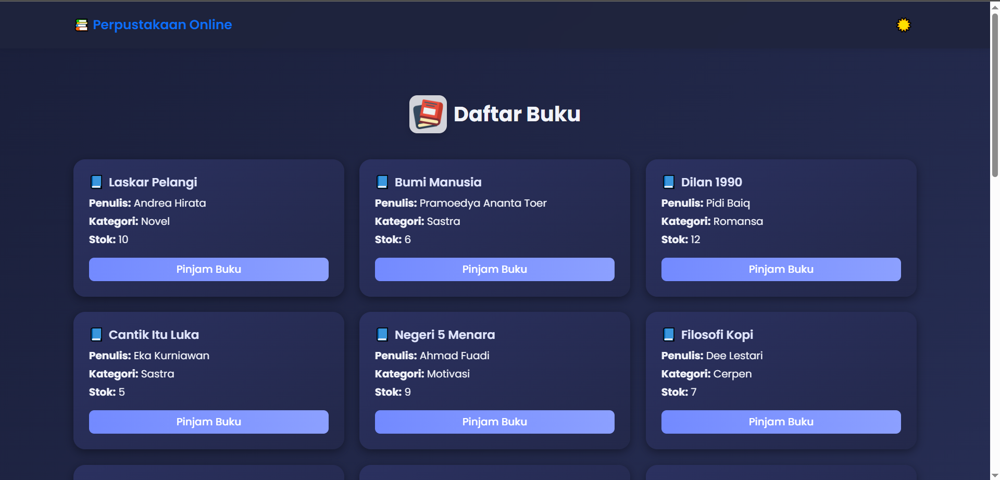
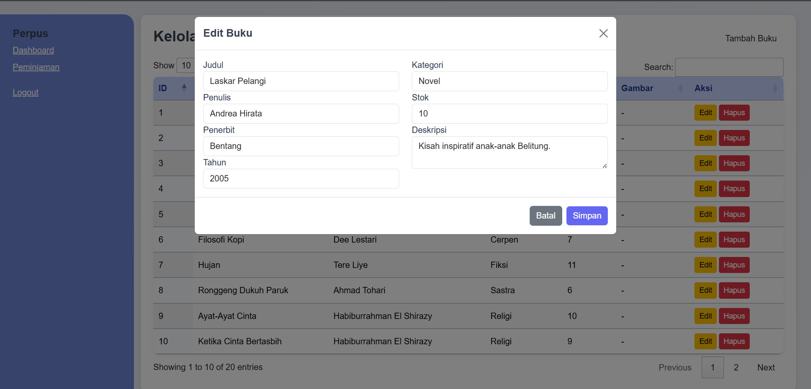
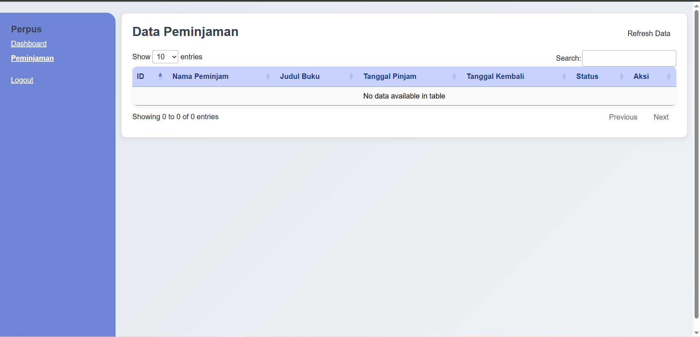

[](https://classroom.github.com/a/lI5-VUUL)
## **`Information for the Final Project Repository`**

### **`🧮 eLibro — Bringing Libraries to the ☁️ Cloud`** 

Kelompok 5 — Metrodata Komdigi Bootcamp Final Project  

---

## 🧩 Deskripsi Umum Proyek    

**Deskripsi Singkat:**  
eLibro adalah sistem perpustakaan digital berbasis web yang dirancang untuk mempermudah pengelolaan koleksi buku dan peminjaman secara online. 
Pengguna dapat mencari buku berdasarkan judul, penulis, atau kategori;
melihat detail seperti sinopsis, tahun terbit, dan penerbit; serta mengecek ketersediaan buku sebelum melakukan peminjaman. 
Di sisi lain, admin memiliki akses penuh untuk melakukan manajemen koleksi buku — mulai dari menambah, mengedit, dan menghapus data, hingga memantau proses peminjaman dan pengembalian buku secara efisien.  

**Tujuan:**  
- Menghadirkan sistem perpustakaan modern berbasis digital yang efisien dan ramah pengguna.  
- Memudahkan pengguna dalam mencari, membaca, dan meminjam buku tanpa harus datang langsung ke perpustakaan.  
- Meningkatkan efisiensi pengelolaan data buku bagi admin secara real-time dan terpusat.  

---

## 💡 Alasan Pemilihan Proyek  

Proyek **eLibro — Bringing Libraries to the Cloud** dipilih karena mendukung konsep *sustainable education* dengan mengintegrasikan literasi dan teknologi digital. Sistem ini membantu mengurangi penggunaan kertas melalui katalog dan transaksi peminjaman digital, sekaligus memperluas akses terhadap sumber bacaan bagi masyarakat di era modern.  
Dengan digitalisasi perpustakaan, manajemen data buku menjadi lebih cepat, akurat, dan transparan. Admin dapat melakukan pembaruan informasi kapan pun, sementara pengguna bisa mengakses koleksi dari mana saja dan kapan saja.  

Secara keseluruhan, eLibro selaras dengan prinsip **keberlanjutan modern** —  
🌱 *environmental*: mengurangi limbah kertas dan konsumsi sumber daya fisik.  
🤝 *social*: meningkatkan literasi dan akses pengetahuan bagi masyarakat luas.  
💼 *economic*: mengoptimalkan efisiensi pengelolaan data dengan biaya operasional yang lebih rendah.  

---

## ⚙️ Fitur Utama Sistem  

### 👨‍💼 Role: Admin  
- CRUD data buku (tambah, ubah, hapus, lihat).  
- Mengelola data peminjaman dan pengembalian buku.  
- Melihat daftar pengguna serta riwayat aktivitas peminjaman.    

### 👩‍🎓 Role: User  
- Mencari buku berdasarkan judul, penulis, atau kategori.  
- Melihat detail buku (judul, penulis, tahun terbit).  
- Mengecek status ketersediaan buku secara real-time.  
- Mengajukan peminjaman buku secara online.  

---

📘 *"eLibro — Because libraries belong in the cloud, not just on shelves."*

---

### 👥 **`Kelompok 5:`**

- **Fatmawati Muhammad Nassrudin**
- **Farhan Maulana**
- **Fadhalfin Mars Agi Putra**
- **Tio Rizky Ramadhani Putra**
- **Taufiq Kurniawan Akbar**

---

### **`Ketentuan Repository:`**

- 💻 Fokus pada pengerjaan kelompok masing-masing.
- 🤓 Untuk kelompok lain bisa sharing
---

### **`Design & Documentation:`**

- [Slide of Presentation](https://www.canva.com/design/DAG4M-QLqv8/iwQhYKvEjGPO73vlTZGIUQ/edit)
- [BPMN - Draw IO](https://drive.google.com/file/d/1se8DE7NzTrKQc2IcQyS30oVE0GTJwKAe/view?usp=drive_link)
- [Entity Relational Diagram - Draw IO](https://dbdiagram.io/d/ERD_eLibro-6911583f6735e11170fb03e4)
- [Data Dummy - Google Sheet](https://docs.google.com/spreadsheets/d/1SRuaifDOGemWvUTve1FQM9PKmqvVk1JVj58CfD1mafU/edit?usp=sharing)
- [Progress of Project - Google Sheet](https://docs.google.com/spreadsheets/d/1S5xoljLv2SANIkMFjy2TC4Cvx-pPVc__WE4LOoZYgYw/edit?usp=sharing)
- [Video Presentation](https://drive.google.com/file/d/17Rhcm8qzm_syxG_OLJZ6e-pJhsc4NK_D/view?usp=sharing)

---

### **`Screenshot:`**






---

### **`Ketentuan Implementasi Repository:`**

- Silahkan clone repository yang sudah disediakan untuk setiap kelompoknya masing-masing.
- Setalah clone, silahkan masukkan folder project **`backend`** & **`frontend`** yang nanti teman-teman buat.
- Untuk folder **`materials`** bisa diarsipkan dari **`hasil akhir final project`** export dari:
  - **Testing endpoint pada postman dengan extension `.postman_collection`**
  - **Database project dengan extension `.sql`**
  - **Create folder `images` untuk menempatkan gambar screenshot project**
    **`NOTE:` di bawah ini merupakan contoh struktur dari folder project.**

```
|-- .gitignore
|-- README.md
|-- materials
    |-- endpoint.postman_collection
    |-- database.sql
    |-- images
        |-- image1.png(jpg,..etc)
|-- serverapp
    |-- .mvn
    |-- src
        |-- main
        |-- test/java/id/co/mii/serverapp
    |-- .gitignore
    |-- mvnw
    |-- mvwn.cmd
    |-- pom.xml
|-- clientapp
    |-- .mvn
    |-- src
        |-- main
        |-- test/java/id/co/mii/clientapp
    |-- .gitignore
    |-- mvnw
    |-- mvwn.cmd
    |-- pom.xml
```
---
